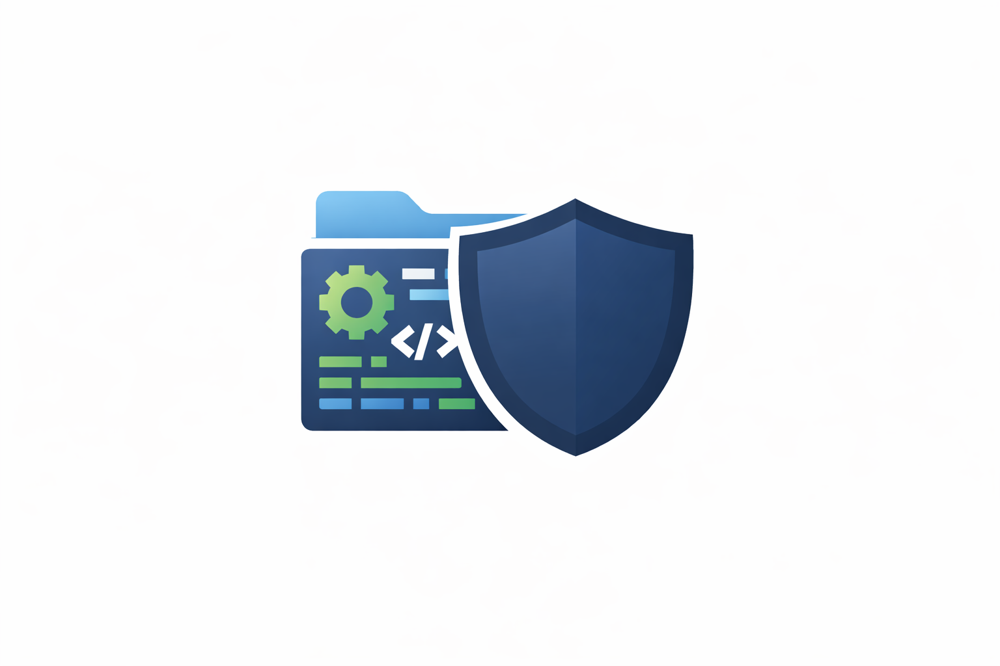

[](https://pub.dev/packages/scale_guard)
[](https://pub.dev/packages/scale_guard/score)
[](https://opensource.org/licenses/Apache-2.0)

# Flutter ScaleGuard

Architecture health check for Flutter apps.

**Flutter ScaleGuard** is a deterministic CLI tool that detects architectural risks in Flutter projects before they become expensive to fix.

Instead of focusing on style or formatting, ScaleGuard analyzes **structural architecture patterns** such as:

- cross-feature coupling
- layer boundary violations
- service locator abuse
- module hotspots
- configuration risks

It helps teams detect **architecture erosion early**, before it slows development.

---

# Quick Start

Install the CLI:

```bash
dart pub global activate scale_guard
```

Run a scan in your Flutter project:

```bash
scale_guard scan .
```

---

# Example Output

```text
Flutter ScaleGuard v0.4.0
Project: ../flarehabit

Architecture Score: 69/100
Risk Level: Medium

Summary:
This codebase shows early-stage coupling patterns that may reduce feature isolation as the team scales.

Dominant Risk Category: Coupling Risk (69% of total penalty)
Most Expensive Risk: Feature Module Imports Another Feature (reduces isolation and scaling flexibility) (-15.0)

Hotspot (source): lib/features/habit_details
Hotspot (target): lib/features/habits
```

---

# CI / Guardrail Usage

ScaleGuard can be used to prevent architectural regressions in CI pipelines.

Example:

```bash
scale_guard scan . --fail-under 70
```

If the architecture score drops below the threshold, the command exits with a failure code.

This allows teams to enforce **architecture quality gates** automatically.

---

# Installation

Global install via Dart:

```bash
dart pub global activate scale_guard
```

Or run directly from the repository:

```bash
dart run bin/scale_guard.dart scan .
```

---

# Usage

Basic scan:

```bash
scale_guard scan .
```

JSON output:

```bash
scale_guard scan . --json
```

Fail if architecture score is too low:

```bash
scale_guard scan . --fail-under 70
```

---

# Output

ScaleGuard produces a structured report containing:

### Architecture Score

Numeric score from **0–100**.

Higher score means lower architectural risk.

### Risk Level

Risk classification based on score:

| Score | Risk Level |
|------|-------------|
| 80–100 | Low |
| 55–79 | Medium |
| 0–54 | High |

### Dominant Risk Category

Identifies the architecture problem contributing most to the score penalty.

### Most Expensive Risk

The single rule responsible for the largest score reduction.

### Hotspots

Files or modules where architectural violations concentrate.

This helps teams focus refactoring effort where it matters most.

---

# Exit Codes

| Code | Meaning |
|-----|--------|
| 0 | Scan completed successfully |
| 1 | Score below `--fail-under` threshold |
| 64 | Invalid command usage |

---

# Configuration (optional)

ScaleGuard can be configured via a `risk_scanner.yaml` file in the project root.

Example configuration options:

| Key | Description | Default |
|----|-------------|--------|
| feature_roots | Paths where feature modules are located | `lib/features` |
| layer_mappings | Mapping of folders to architecture layers | presentation / domain / data |
| ignored_patterns | File patterns to exclude from analysis | generated files |
| god_file_medium_loc | LOC threshold for medium file size risk | 500 |
| god_file_high_loc | LOC threshold for high file size risk | 900 |

---

# Rules

ScaleGuard currently detects the following architecture risks:

### Cross Feature Coupling
Feature modules importing other feature modules.

### Layer Violations
Invalid dependencies between architecture layers.

Example:
```text
presentation → data
```

### God Files
Files exceeding defined size thresholds.

### Hardcoded Scale Risks
Configuration values embedded directly in code.

### Service Locator Abuse
Global dependency access patterns.

### Shared Boundary Leakage
Shared modules importing feature modules.

### Navigation Coupling
Direct route usage instead of centralized navigation.

---

# Design Principles

ScaleGuard is intentionally designed to be:

**Deterministic**  
Same code always produces the same result.

**Fast**  
Scans large Flutter projects in seconds.

**Opinionated**  
Focused specifically on architectural scale risks.

**CLI-first**  
Simple tooling that integrates easily into CI pipelines.

---

# When to Use ScaleGuard

ScaleGuard is useful when:

- preparing a Flutter app for scale
- auditing an existing codebase
- reviewing architecture health during development
- preventing architecture decay in CI
- identifying refactoring hotspots

---

# License

Apache License 2.0.

See the [LICENSE](LICENSE) file for details.
